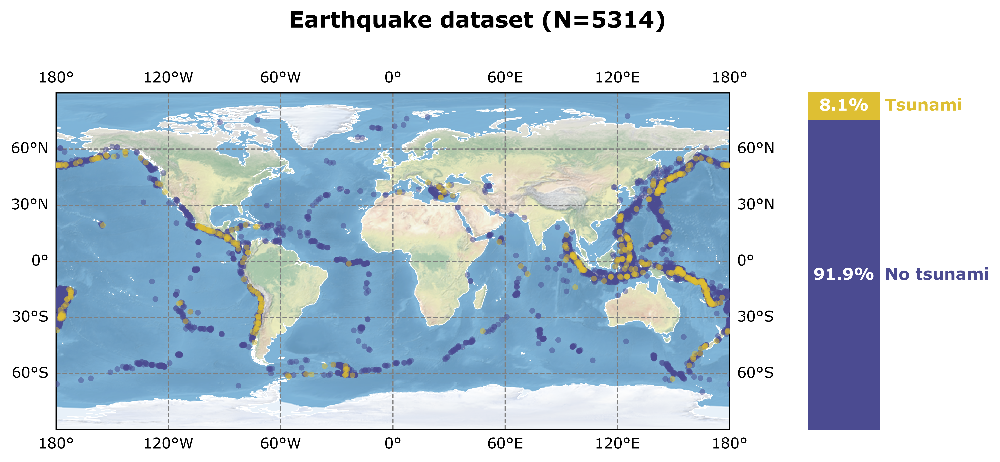

# TsunamiClassifier 🌊💻⚙️
A **neural network model for binary classification of seismic events**, distinguishing earthquake events that generate tsunamis from those that do not. Leveraging deep learning to enhance tsunami prediction accuracy and improve early warning systems.

- [TsunamiClassifier 🌊💻⚙️](#tsunamiclassifier-️)
  - [Structure of the repo 📁](#structure-of-the-repo-)
  - [About the data 📊](#about-the-data-)
    - [Data source 🔍](#data-source-)
    - [Data labeling methodology 🏷️](#data-labeling-methodology-️)
  - [Feature Engineering 🛠️](#feature-engineering-️)
    - [Longitude and latitude 📍🗺️](#longitude-and-latitude-️)
  - [Performance of the model 🎯](#performance-of-the-model-)

## Structure of the repo 📁

- 📂 [**data**](/data): Folder where the dataset (earthquakes.csv) is stored.
- 📂 [**images**](/images): Folder with some images.
- 📂 [**models**](/models): Folder in which the outputs of the notebook are stored. Specifically, the folder contains the model in an .h5 file and two pkl files needed to evaluate the model.
- 📂 [**utils**](/utils): Folder with a Python script used for plotting purposes.
- 📄[**notebook_tsunami.py**](notebook_tsunami.ipynb): Notebook used to compute the EDA and the training and validation of the model.
- 📄[**README.md**](README.md): This README file.
- 📄[**requirements.txt**](requirements.txt): A requirements.txt file with the notebook's dependencies.

## About the data 📊

### Data source 🔍

The dataset used for training the model is stored at the data folder as [earthquakes.csv](/data/earthquakes.csv). This dataset is generated with earthquake data gathered from [USGS earthquakes database](https://www.usgs.gov/programs/earthquake-hazards/earthquakes).

### Data labeling methodology 🏷️

To label each register of the dataset, a numerical model that generates and propagates the potential tsunami wave from the earthquake is used. After verifying the output of the numerical model, a criterion is applied to binarize the earthquake events into tsunami or non-tsunami. This criterion has been set to a threshold in the maximum wave height parameter, specifically to 0.16 m of wave height.

      
      Fig 1. Map of the earthquake dataset with the tsunami label.

## Feature Engineering 🛠️

### Longitude and latitude 📍🗺️

The longitude and latitude coordinates were encoded using the Count Encoding cross bucketing technique. That is, both longitude and latitude are encoded into a single value that represents the number of positive events in each map cell.

## Performance of the model 🎯

The following figure shows the confusion matrix for the test set. The percentage of false negatives has been reduced to 0.3%, which is an optimal outcome considering the objective of minimizing this error. Although minimizing false positives is also important, the focus of this study prioritized reducing false negatives due to their greater relevance in this context.

      

