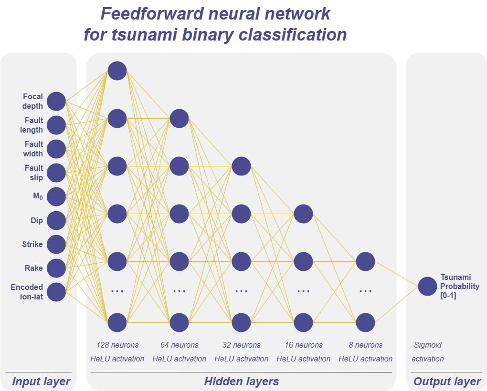
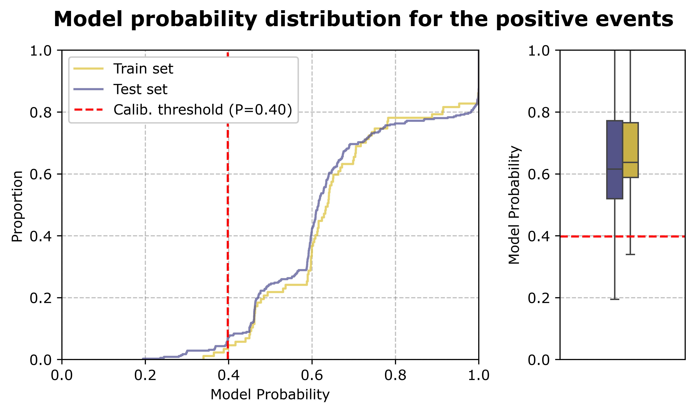

# TsunamiClassifier 🌊💻⚙️
A **neural network model for binary classification of seismic events**, distinguishing earthquake events that generate tsunamis from those that do not. Leveraging deep learning to enhance tsunami prediction accuracy and improve early warning systems.

- [TsunamiClassifier 🌊💻⚙️](#tsunamiclassifier-️)
  - [Structure of the repository 📁](#structure-of-the-repository-)
  - [About the data 📊](#about-the-data-)
    - [Data source 🔍](#data-source-)
    - [Data labeling methodology 🏷️](#data-labeling-methodology-️)
  - [Feature Engineering 🛠️](#feature-engineering-️)
    - [Longitude and latitude 📍🗺️](#longitude-and-latitude-️)
    - [Other features](#other-features)
  - [About the model 🧠💻](#about-the-model-)
    - [Performance achieved 🎯](#performance-achieved-)
  - [Contact 🙋🏻‍♂️](#contact-️)

## Structure of the repository 📁

- 📂 [**data**](/data): Folder where the dataset (earthquakes.csv) is stored.
- 📂 [**images**](/images): Folder with some images.
- 📂 [**models**](/models): Folder in which the outputs of the notebook are stored. Specifically, the folder contains the model in an .h5 file and two pkl files needed to evaluate the model.
- 📂 [**utils**](/utils): Folder with a Python script used for plotting purposes.
- 📄[**notebook_tsunami.py**](notebook_tsunami.ipynb): Notebook used to compute the EDA and the training and validation of the model.
- 📄[**README.md**](README.md): This README file.
- 📄[**requirements.txt**](requirements.txt): A requirements.txt file with the notebook's dependencies.

## About the data 📊

### Data source 🔍

The dataset used for training the model is stored at the data folder as [earthquakes.csv](/data/earthquakes.csv).

This dataset is generated with earthquake data gathered from the **USGS [ANSS Comprehensive Earthquake Catalog (ComCat)](https://earthquake.usgs.gov/data/comcat/)**. The catalog started providing data since 1976 and includes seismic parameters such as hypocenters, magnitudes, phase picks, and amplitudes. With this data, new variables are calculated by applying analytical formulations, in particular the **[Okada parametrization](https://www.bosai.go.jp/e/sp/pdf/Okada_1985_BSSA.pdf)**, which assumes that an earthquake can be considered as the rupture of a single fault plane. With this method, relevant parameters such as slip (vertical displacement of the fault), various angles (strike, dip, and rake), and geometric fault parameters (length and width) are inferred.

### Data labeling methodology 🏷️

To label each register of the dataset, a numerical model that generates and propagates the potential tsunami wave from the earthquake is used. After verifying the output of the numerical model, a criterion is applied to binarize the earthquake events into tsunami or non-tsunami. This criterion has been set to a **threshold** in the maximum wave height parameter, specifically to **0.15 m of wave height**.

Fig 1 displays an animated map showing events labeled as either tsunamis or non-tsunamis. The final dataset consists of **5,315 events**, with **8.15% classified as tsunamis** and **91.85% as non-tsunamis**.

      
      Fig 1. Map of the earthquake dataset with the tsunami label (the size of the points indicates the magnitude of each event).

## Feature Engineering 🛠️

### Longitude and latitude 📍🗺️

The longitude and latitude coordinates were encoded using the **Count Encoding cross-bucketing** technique (Fig 2). That is, both longitude and latitude are encoded into a single value that represents the number of positive events in each map cell. To estimate this count more robustly, bootstrapping was applied, allowing for the derivation of a reliable statistic from multiple samples given the absence of complete population data.

      
       Fig 2. Map of the count of tsunamis in each lon-lat cell.

### Other features

- A simple **conversion to radians** has been applied to the **angle features (strike, dip, and rake)**. With the exception of the **rake angle**, which was converted by calculating the **difference to 90º**.
- Features with larger values, such as **focal depth, Mo, and fault length and width**, were **scaled logarithmically**.
- The rest of the features, the **slip** and the **lon-lat count**, were normalized with a **standard scale** and a **min-max scale**, respectively.

## About the model 🧠💻

The resulting model is a **feedforward neural network (FNN)** comprising an **input layer with a dimension of 9**, **five hidden layers** with 128, 64, 32, 16 and 8 neurons, respectively, and an output layer that depicts the tsunami probability (see Fig 3).

      
       Fig 3. Diagram of the ANN model.

### Performance achieved 🎯

Fig 4 shows the confusion matrix for the test set. The percentage of **false negatives has been minimized to 0.3%**, which is an optimal outcome considering the objective of minimizing this type of error. Although minimizing false positives is also important, the focus of this study was on reducing false negatives due to their greater relevance in considering the consequences of the tsunamis.

      
       Fig 4. Confusion matrix for the test set.

 

Figure 5 shows the **model's probability distribution for positive events**, which helps us understand how well it predicts. The model assigns a minimum probability of approximately 0.4 to positive events in the test set, demonstrating that even when the model makes an incorrect prediction, it does so by attributing a relatively high probability. The **interquartile range**, spanning from **0.6 to 0.8**, shows the model can identify positive events with **relatively high probabilities**.

      
       Fig 5. Model positive probability for positive events.

## Contact 🙋🏻‍♂️

👨🏻‍💻 Albert Gallego Jiménez
📧 agalleji8@gmail.com
📧 gallegoa@unican.es
🌐 [LinkedIn](https://www.linkedin.com/in/albert-gallego-jimenez)